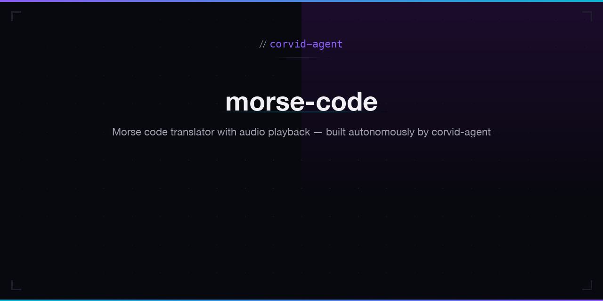

# Morse Code

Morse code translator with audio playback.

**Live:** [corvid-agent.github.io/morse-code](https://corvid-agent.github.io/morse-code/)

## Features

- Real-time text to Morse and Morse to text conversion
- Audio playback with Web Audio API synthesized tones
- Adjustable speed (5-25 WPM)
- Visual dot/dash animation during playback
- Copy to clipboard
- Complete A-Z, 0-9 reference chart
- Responsive mobile design

## Tech Stack

- Static HTML/CSS/JavaScript
- Web Audio API
- Dogica Pixel + Press Start 2P typography

## License

MIT
